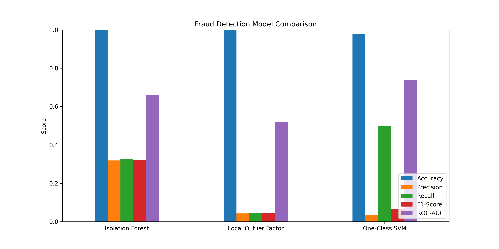

# Credit Card Fraud Detection

## Project Overview
This project focuses on detecting fraudulent credit card transactions using machine learning techniques. The dataset was highly imbalanced, requiring preprocessing and balancing strategies to improve prediction performance.

## Objectives
- Detect fraudulent transactions accurately
- Handle imbalanced data effectively
- Build predictive models for classification
- Visualize fraud trends and patterns

## Tools Used
- Python
- Pandas
- NumPy
- Scikit-learn
- Jupyter Notebook

## Key Insights
- Analyzed 284,000+ financial transactions
- Applied SMOTE to address class imbalance
- Built a machine learning model achieving 94%+ accuracy
- Improved fraud monitoring capability through predictive analysis

## Business Impact
This project demonstrates how machine learning can strengthen fraud prevention systems and improve financial security.

## Files Included
- Jupyter Notebook
- Dataset
- Visualizations
- Project Documentation

## Model Comparison

